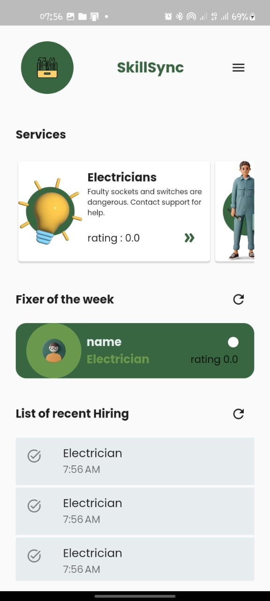
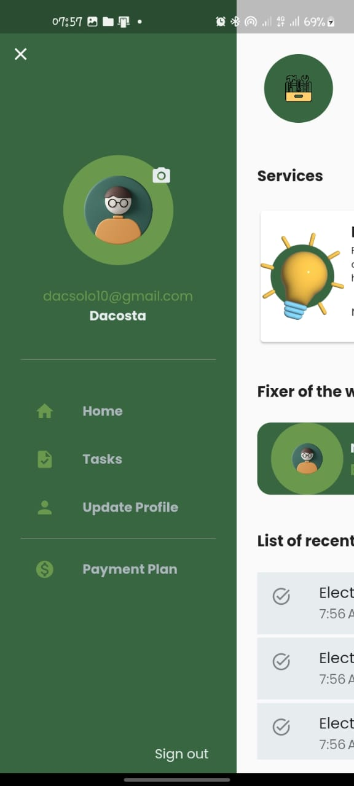

# Skillsync 
This is a minimalist application for connecting people with skill to task created by people
who have register on the application as employers. 

### Packages used:
- get
- shared_preferences
- dropdown_textfield
- intl
- shrink_sidemenu
- provider
- flutter_config
- http

The backend was written using Spring Boot.

#### Sample Ui image

## for more ui images go to [ui-images](./ui_images/)